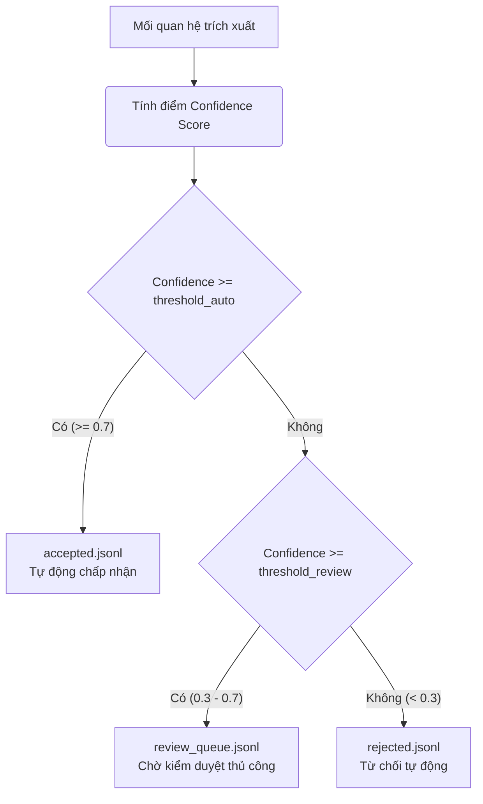

# Quy Trình Trích Xuất và Xác Thực Thực Thể/Quan Hệ bằng LLM (AI Extract Workflow)

Tài liệu này mô tả chi tiết luồng xử lý của các module **AI Extraction**, **Validation**, **Scoring**, và **Decision Gate** thuộc Graph Construction Pipeline trong hệ thống Legal GraphRAG VN.

---

## 1. Tóm Tắt Quy Trình Hoạt Động (Workflow Steps)

Quy trình xử lý trích xuất và xác thực AI bao gồm 5 bước chính sau:

1. **Nhập dữ liệu phân cấp**:
   * Hệ thống đọc tệp cấu trúc phân cấp pháp luật `data/processed/<doc_id>/hierarchy.json` (được tạo ra bởi [Hierarchy Parser](file:///D:/Workspace/Project/pipline/docs/parse_workflow.md)).
2. **Trích xuất thông tin 2-pass (2-Pass LLM Extraction)**:
   * Duyệt qua từng Điều ([Article](file:///D:/Workspace/Project/pipline/src/parser/models.py#L39)) để trích xuất:
     * **Pass 1 (Entity Extraction)**: LLM tìm tất cả thực thể pháp lý.
     * **Pass 2 (Relation Extraction)**: LLM tìm các mối quan hệ giữa các thực thể vừa phát hiện kèm câu dẫn chứng (evidence).
3. **Xác thực Schema & Ontology (Validation)**:
   * **JSON Schema Validation**: Re-validate dữ liệu đầu ra từ LLM để đảm bảo đúng định dạng cấu trúc JSON.
   * **Ontology Validation**: Kiểm tra logic đồ thị nghiệp vụ (các loại thực thể nào được kết nối với nhau, chiều liên kết, kiểm tra tự lặp, và cấp bậc văn bản đối với quan hệ `IMPLEMENTED_BY`).
4. **Đánh giá điểm tin cậy (Confidence Scoring)**:
   * Chấm điểm độ tự tin cho mỗi quan hệ dựa trên tổ hợp 5 tiêu chí với trọng số định sẵn (Schema, Ontology, Presence of Evidence, Resolvability, Direction).
5. **Cổng Quyết định (Decision Gate)**:
   * Phân loại quan hệ và ghi kết quả vào các file lưu trữ phù hợp (`accepted.jsonl`, `review_queue.jsonl`, hoặc `rejected.jsonl`).

---

## 2. Chi Tiết Các Bước Xử Lý

### Bước 1: 2-Pass LLM Extraction

Hàm [process_article](file:///D:/Workspace/Project/pipline/src/pipeline/orchestrator.py#L37) điều phối luồng gọi thông qua [extract_article](file:///D:/Workspace/Project/pipline/src/extraction/llm_extractor.py#L30) để chia việc trích xuất thành 2 bước riêng biệt nhằm cải thiện độ chính xác và tránh quá tải ngữ cảnh cho LLM:

*   **Pass 1: Trích xuất thực thể (Entity Extraction)**:
    *   Sử dụng [ENTITY_EXTRACTION_PROMPT](file:///D:/Workspace/Project/pipline/src/extraction/prompts.py#L11).
    *   Yêu cầu LLM nhận diện các thực thể thuộc 6 lớp thực thể: `Document`, `Article`, `Clause`, `Point`, `Concept`, và `Entity`.
*   **Pass 2: Trích xuất mối quan hệ (Relation Extraction)**:
    *   Sử dụng [RELATION_EXTRACTION_PROMPT](file:///D:/Workspace/Project/pipline/src/extraction/prompts.py#L26).
    *   Đưa danh sách thực thể đã tìm thấy từ Pass 1 làm đầu vào cho Pass 2.
    *   Yêu cầu LLM liên kết các thực thể bằng 9 loại quan hệ: `CONTAINS`, `AMENDED_BY`, `REPLACED_BY`, `REPEALED_BY`, `IMPLEMENTED_BY`, `REFERENCES`, `DEFINES`, `REGULATES`, `REQUIRES`.
    *   LLM bắt buộc phải cung cấp một chuỗi `evidence` trích xuất trực tiếp từ văn bản gốc làm căn cứ.

**Hỗ trợ đa LLM Provider**:
Hệ thống sử dụng cơ chế Factory [get_provider](file:///D:/Workspace/Project/pipline/src/extraction/providers/__init__.py#L9) để khởi tạo provider thích hợp dựa vào cấu hình `llm_provider`:
*   **Google Gemini ([GeminiProvider](file:///D:/Workspace/Project/pipline/src/extraction/providers/gemini_provider.py#L29))**: Sử dụng thư viện `google-genai` truyền trực tiếp Pydantic schema vào tham số `response_schema` để ép kiểu JSON chặt chẽ ở cấp độ API.
*   **OpenAI-Compatible ([OpenAICompatibleProvider](file:///D:/Workspace/Project/pipline/src/extraction/providers/openai_provider.py#L30))**: Hỗ trợ MiniMax, Qwen, hoặc OpenAI. Nếu mô hình không hỗ trợ Structured Outputs, hệ thống tự động fallback sang chế độ JSON thô kèm prompt mô tả schema, sau đó làm sạch và chuẩn hóa ID thực thể bằng regex.

---

### Bước 2: Xác Thực Schema & Ontology (Validation)

Mỗi quan hệ sau khi trích xuất sẽ được đưa qua hai tầng lọc nghiệp vụ:
1.  **JSON Schema Validation ([schema_validator.py](file:///D:/Workspace/Project/pipline/src/validation/schema_validator.py))**:
    *   Đảm bảo kiểu dữ liệu và định dạng khớp chuẩn xác với các mô hình Pydantic [ExtractedRelation](file:///D:/Workspace/Project/pipline/src/extraction/models.py#L42).
2.  **Ontology Validation ([ontology_validator.py](file:///D:/Workspace/Project/pipline/src/validation/ontology_validator.py))**:
    *   Kiểm tra ràng buộc giữa cặp thực thể (`valid_pairs`): Ví dụ, quan hệ `CONTAINS` chỉ được đi từ `Article` $\rightarrow$ `Clause`, không được đi ngược lại hay nối giữa thực thể khác.
    *   Ngăn chặn tự lặp (`no_self_loop`): Không cho phép thực thể tự liên kết với chính nó đối với các quan hệ như `CONTAINS`, `AMENDED_BY`, `REPLACED_BY`.
    *   Quy tắc cấp bậc tài liệu (Document Level Rule) cho quan hệ `IMPLEMENTED_BY`: Luật cấp cao hơn chỉ có thể được hướng dẫn bởi Luật/Nghị định/Thông tư cấp thấp hơn (suy luận cấp độ từ cấu trúc [DOCUMENT_LEVELS](file:///D:/Workspace/Project/pipline/src/validation/ontology_validator.py#L16)).

---

### Bước 3: Đánh Giá Điểm Tin Cậy (Confidence Scoring)

Hệ thống tính toán điểm số tổng hợp cuối cùng từ $0.0$ đến $1.0$ thông qua module [confidence_scorer.py](file:///D:/Workspace/Project/pipline/src/scoring/confidence_scorer.py) dựa trên 5 tiêu chí:

| Tiêu chí | Trọng số | Phương pháp tính toán |
| :--- | :---: | :--- |
| **Schema Valid** | $0.3$ | Đạt $1.0$ nếu khớp hoàn hảo định dạng Pydantic Schema; ngược lại $0.0$. |
| **Ontology Valid** | $0.3$ | Đạt $1.0$ nếu thỏa mãn tất cả quy tắc ràng buộc quan hệ đồ thị; ngược lại $0.0$. |
| **Evidence Present** | $0.2$ | Tính toán trùng lặp cục bộ (Token Overlap) hoặc tìm kiếm chuỗi con (Exact Substring) giữa chuỗi bằng chứng (`evidence`) của LLM với văn bản gốc của Điều luật. Không tốn chi phí gọi API LLM phụ. |
| **Entities Resolvable** | $0.1$ | Tỷ lệ thực thể đầu (`head`) và cuối (`tail`) có thể đối chiếu (resolve) được trong danh sách thực thể đã biết của đồ thị. |
| **Direction Correct** | $0.1$ | Đạt $1.0$ nếu chiều quan hệ đồ thị phù hợp với nghiệp vụ đã quy định trong Ontology; ngược lại $0.0$. |

---

### Bước 4: Phân Loại và Cổng Quyết Định (Decision Gate)

Kết quả trích xuất được định tuyến tự động vào các luồng lưu trữ JSONL riêng biệt dựa trên ngưỡng cấu hình tại [Settings](file:///D:/Workspace/Project/pipline/src/config.py#L16):

*   **Tự động chấp nhận (`accepted.jsonl`)**: Các mối quan hệ có chất lượng và bằng chứng rõ ràng, sẵn sàng để nạp (ingest) vào cơ sở dữ liệu đồ thị Neo4j.
*   **Hàng đợi kiểm duyệt (`review_queue.jsonl`)**: Các liên kết có độ tin cậy vừa phải, cần chuyên viên pháp lý xem xét và chỉnh sửa bằng tay thông qua giao diện admin UI.
*   **Từ chối tự động (`rejected.jsonl`)**: Các liên kết bị sai schema, vi phạm nghiêm trọng ontology hoặc không có bằng chứng văn bản.

---

## 3. Các Case Biên và Giới Hạn Hiện Tại (Edge Cases & Limitations)

*   **Thiếu Document Registry liên văn bản (M1+M2)**: 
    *   Do M1+M2 hoạt động độc lập trên từng tài liệu và chưa tích hợp Database Đồ thị (Neo4j), mối quan hệ `IMPLEMENTED_BY` giữa tài liệu hiện tại với các văn bản khác sẽ chưa có dữ liệu kiểm chứng cấp độ (Document Level). Hệ thống sẽ gắn nhãn `tail_level=None` và đẩy các liên kết này vào `review_queue.jsonl` thay vì tự động chấp nhận sai. Đây là thiết kế an toàn có chủ đích.
*   **Sai lệch định dạng ID thực thể (ID Normalization)**:
    *   LLM đôi khi sinh ra các ID chứa ký tự tiếng Việt có dấu, khoảng trắng hoặc ký tự đặc biệt làm gãy Schema. Hệ thống đã tích hợp bộ chuẩn hóa ID tự động chuyển đổi văn bản sang ký tự không dấu và dạng `snake_case` trước khi kiểm tra hợp lệ.
